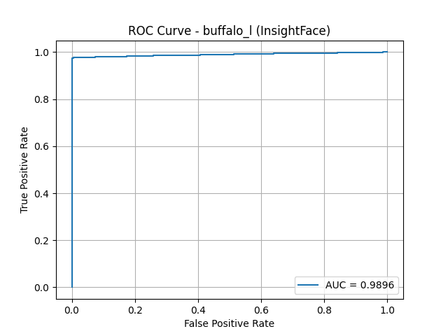
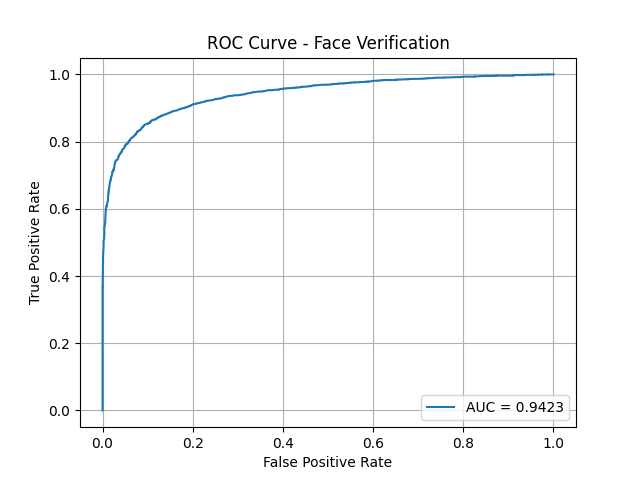

# 📦 Embedded_Edge_Cloud  
**에지-클라우드 협업 기반 고정밀 얼굴 인식 보안 시스템**

---

## 📌 프로젝트 소개

본 프로젝트는 에지 디바이스(Raspberry Pi)와 클라우드 서버(AWS EC2)를 연동하여,  
**고정밀 얼굴 인식 기반의 보안 시스템**을 구현하는 것을 목표로 합니다.  

- 에지에서 얼굴 검출 및 전처리 수행  
- 클라우드에서 고정밀 얼굴 인식 모델을 활용한 신원 확인  
- 전송 지연 최소화 및 에너지 효율 극대화를 위한 시스템 구성  

---

## 🔧 시스템 구성

```
[Raspberry Pi + CSI Camera]
        │
  얼굴 검출 및 전처리 (0.1초 간격)
        │
        ▼
  [HTTP] 전송 (3 frame spike)
        │
        ▼
[AWS EC2 서버 (Python + Flask)]
  - InsightFace 얼굴 인식 추론
  - 응답 반환 (bbox, accuracy, name)
```

---

## 🔗 AWS EC2 서버 환경

- 인스턴스 타입: `t2.micro` (Free-tier)
- GPU 필요 시: `g4dn.xlarge` (NVIDIA T4, 약 $0.526/hr) or `g6dn.xlarge`

---

## 🔗 노트북 서버 환경

- Ubuntu 22.04
- GPU: NVIDIA GeForce RTX 2050

---

## 📁 프로젝트 폴더 구조

```bash
Embeded_Edge_Cloud/
├── Sehoon                     # Sehoon 개별 WorkSpace
├── Jaeyeong                   # Jaeyeong 개별 WorkSpace
├── registered_faces           # 임베딩 등록용 사진 경로
├── edge_cloud                 # 에지 클라우드 협업업 시스템 실행 코드
├── edge_only                  # 에지 only 시스템 실행 코드
├── eval_performance           # 시스템별 ROC, AUC 테스트 코드
├── README.md                  # 프로젝트 설명 문서
└── progress_1                 # 테스트 결과 이미지 저장 폴더
```

---

## 🚀 실행 방법 (Usage)

### EC2 server 실행

```bash
cd edge_cloud
python server.py
```

### 라즈베리파이 edge 실행
```bash
cd edge_cloud
python edge.py
```

### 라즈베리파이 edge_only 실행
```bash
cd edge_only
python edge_only_buffalo_s_quantized_copy
```

---


## 📊 성능 평가 결과

| 시스템       | AUC    | TPR@FAR=1e-3 | 평균 처리 시간 (RTT) |
|--------------|--------|---------------|-----------------------|
| Edge-Cloud-AWS   | 0.9896  | 0.9748         | ~0.05초               |
| Edge-Cloud-Laptop   | 0.9896  | 0.9748         | ~0.15초               |
| Edge-only    | 0.9423  | 0.4563         | ~0.19초               |

### ROC Curve

#### AWS&Laptop


#### Edge_Only



---
## 👥 팀원별 작업 분담

| 이름            | 역할                                  |
| ------------- | ----------------------------------- |
| 세훈 (Sehoon)   | EC2 서버 세팅, 에지+클라우드 모델 최적화 |
| 재영 (Jaeyoung) | 노트북 서버 세팅, 에지+클라우드 모델 최적화 |

---

## 📎 참고

> 본 프로젝트는 현재 완료 버전입니다.
> 미완성 코드도 commit 및 branch를 통해 관리되고 있습니다.

- 📌 [프로젝트 GitHub 링크](https://github.com/sehoon120/Embeded_Edge_Cloud)
- 📄 얼굴 인식 모델: InsightFace
- 📷 카메라 모듈: Raspberry Pi CSI camera + Picamera2

---

## 📄 라이선스 및 출처

- 얼굴 인식 모델: [InsightFace (Apache 2.0 License)](https://github.com/deepinsight/insightface)
- 본 프로젝트는 **연구 및 교육 목적**으로 개발되었으며, **상업적 사용은 금지**됩니다.
- 사용된 이미지 데이터는 LFW (Labeled Faces in the Wild) 데이터셋을 기반으로 합니다.

---